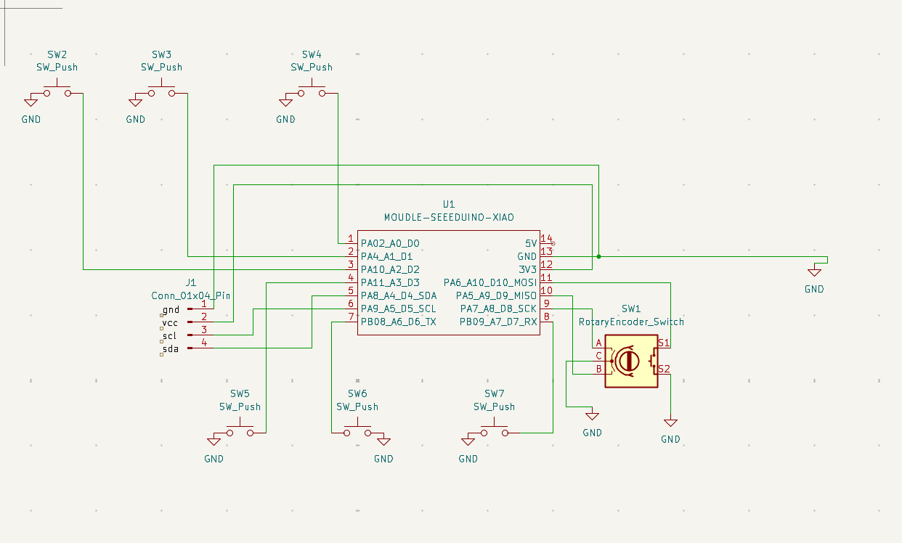
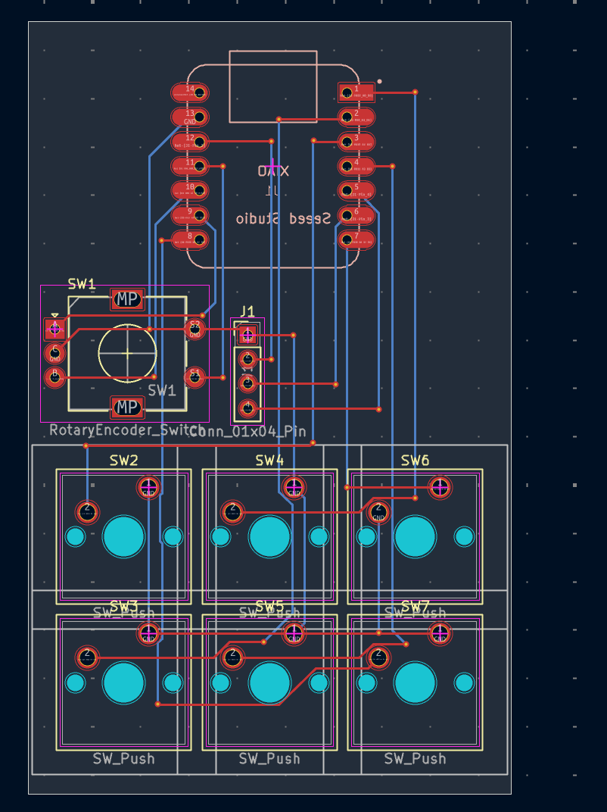

# Klordpad
Klordpad is a 6 key macropad with a rotary encoder and an OLED Dislay! 

It is built for faster git commands, keyboard shortcuts and enhanced gaming

## Features:
- Dual Layer acrylic case
- 128x32 OLED Display
- EC11 ROtary encoder for modes
- 6 keys

CAD Model: everything fits together using 5 M3 Bolts and heatset inserts. 4 for the case, one for the PCB. 

It has 2 separate printed pieces: The base and the top. 

PCB:

Here's my PCB made in KiCad:

Schematic

PCB

## Firmware Overview

This hackpad uses python for firmware.